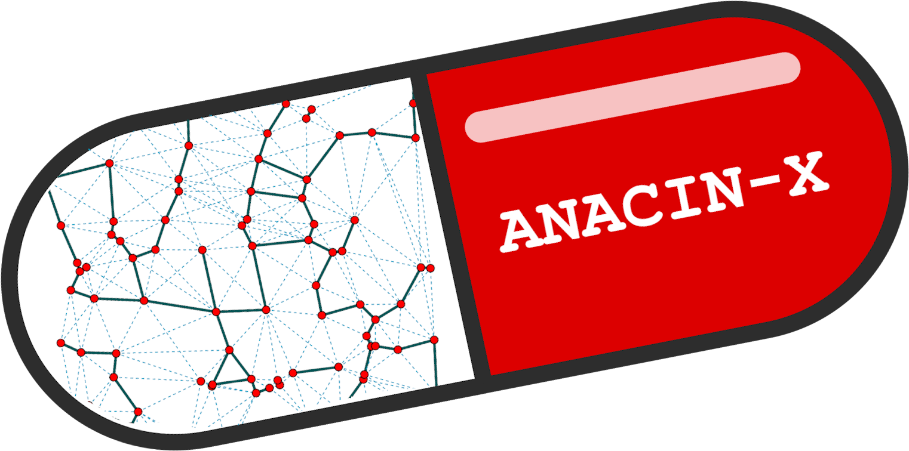

# ANACIN-X
## Project Overview
Runtime non-determinism in High Performance Computing (HPC) applications presents steep challenges for computational reproducibility and correctness. These challenges are magnified in the context of complex scientific codes where the links between observable non-determinism and root causes are unclear. This repository contains a suite of tools for trace-based analysis of non-deterministic behavior in MPI applications. The core components of this tool suite are: 
* Tracing Modules: We use a stack of PMPI modules composed with [PnMPI](https://github.com/LLNL/PnMPI) to trace executions of non-deterministic MPI applications.
  * Provide reference to tracing modules
* Event Graph Construction: We convert each execution's traces into a graph-structured model of the interprocess communication that took place during the execution.
  * Provide reference to dumpi_to_graph
* Event Graph Analysis: We implement workflows for identifying root causes of non-deterministic behavior.
* Communication Pattern Generator: We implement some respresentative sample MPI point-to-point, non-deterministic communication patterns for illustrating the value of Tracing, Event Graph Construction, and Event Graph Analysis in the process of debugging non-determinism.
* Need to provide reference to explain communication patterns here.

## Installation

If you haven't already, you'll need to install the Spack and Conda package managers.

Also, make sure that you've set up an ssh key pair with github for your machine.

### Spack:
Spack is a package manager with good support for scientific/HPC software. To use Spack you will need Python. We recommend you install Spack *and* enable Spack's shell integration. 

To install Spack, follow the instructions at: [Spack Install](https://spack.readthedocs.io/en/latest/getting_started.html)

In particular, make sure to follow the instructions under "Shell support". This step will allow software installed with Spack to be loaded and unloaded as [environment modules.](https://spack.readthedocs.io/en/latest/getting_started.html#installenvironmentmodules) 

### Conda:
Conda is a cross-language package, dependency, and environment manager. We use Conda to manage the dependencies of ANACIN-X's Python code. 

To install Conda, follow the instructions at: [Conda Install](https://conda.io/projects/conda/en/latest/user-guide/install/index.html)

Before continuing, make sure to activate your version of conda:

```
source ~/.bashrc
```

### SSH:
We use SSH to install github packages.

To set up an SSH key pair, follow the instructions at: [SSH Setup](https://docs.github.com/en/github/authenticating-to-github/generating-a-new-ssh-key-and-adding-it-to-the-ssh-agent)

### ANACIN-X:
You will need to first download the project through git using

```
git clone https://github.com/TauferLab/Src_ANACIN-X.git
```

To begin, we stongly recommend using the following command to install dependencies for the project. 

```
. setup_deps.sh
``` 

Note that Spack, Conda, and SSH will need to be installed and set up beforehand as described above.  If there is a specific C compiler that you wish to have used in the install procedure, please see the 'Special Cases' section below.

The script will begin by verifying some information.  Follow the prompts at the beginning, and then the installation will run on its own.  The installation of all dependencies may take some time to complete.

Assuming all dependenices are installed and loaded, you should then be able to build all of ANACIN-X's components by running

```
. setup.sh
```

### Special Case:

If you have a specific external C compiler installed that you wish to use, you will need to edit the compilers.yaml file in spack:
* First open the compilers.yaml file to determine which compilers are added to the system.  This can be done with the command:

```
spack config edit compilers
```

* If you don't see information for your compiler in the listed options, exit the file and make sure your compiler is installed and loaded.  Then use the following command before reopening the compilers.yaml file.

```
spack compiler find
```

* Within the compilers.yaml file, delete information for all compilers other than the one you wish to use.
* Save and quit the file, then try to install the ANACIN-X dependencies.


## Dependencies:
### Installed by User
The following packages need to be installed by the user:
* spack
* conda
* C Compiler (ex. GCC)

### Installed by Spack
The following packages will be installed via spack:
* boost
* cmake
* igraph
* nlohmann-json
* libunwind
* spdlog

### Installed by Conda
The following packages will be installed via conda:
* ruptures
* pyelftools
* pkg-config
* pkgconfig
* eigen (first gets installed through Spack)

### Installed by Pip
The following packages will be installed via pip:
* grakel
* python-igraph
* mpi4py
* graphkernels

### Submodule Packages
The following packages will be installed as submodules to the installation of ANACIN-X:
* [PnMPI](https://github.com/LLNL/PnMPI/tree/f6fcc801ab9305352c510420c6439b7d48a248dc)
* [sst-dumpi](https://github.com/TauferLab/sst-dumpi/tree/b47bb77ccbe3b87d585e3701e1a5c2f8d3626176)
* [Pluto](https://github.com/TauferLab/Src_Pluto/tree/main)
* [dumpi_to_graph](https://github.com/TauferLab/Src_dumpi_to_graph/tree/3966d25a916ddf0cd5e4e71ce71702798c0f39e1)


## Running ANACIN-X:

Use the 'comm_pattern_analysis.sh' script to generate traces of a selected communication pattern and perform analysis on the event graphs:

The following command line switches can be used to define parameters for your job submission:
* -p : Defines the size of the mpi communicator used when generating communication patterns. (Default 4 MPI processes)
* -i  : Defines the number of times a given communication pattern appears in a single execution of ANACIN-X. (Default 1 iteration)
* -s : The size in bytes of the messages passed when generating communication patterns. (Default 512 bytes)
* -n : The number of compute nodes requested for running the ANACIN-X workflow. (Default 1 node)
* -r  : The number of runs to make of the ANACIN-X workflow. (Default 2 executions)
* -o : If used, allows the user to define their own path to store output from the project. (Defaults to the directory '$HOME/comm_pattern_output')
* -v : If used, will display the execution settings prior to running the execution.
* -h : Used to display the list of switch options.

If you're running on a system that uses the Slurm scheduler, then the following switches can be used to define settings for job submission:
* -sq : Defines the queue to submit Slurm jobs to. (Defaults to the "normal" queue)
* -st  : A maximum time limit in minutes on the time provided to jobs submitted. (Default 10 minutes)

Below is an example run of the script as one might submit it on the Stampede2 cluster computer:

```
. ./comm_pattern_analysis.sh -p 10 -n 2 -v -r 50 -q "skx-normal" -o $WORK2/anacinx_output_1
```

Be aware that if you run the project on some machines and some job queues, there will be a limit to the number of jobs that can be submitted.  In such cases, you may lose some jobs if you try to run the program with settings that produce more jobs than are allowed in the queue being used.

### Result Visualization: 


### Supported Systems and Settings:

Currently, the software supports the following types of scheduler systems for job submission:
* LSF scheduled systems (ex. Tellico)
* Slurm scheduled systems (ex. Stampede2)
* Unscheduled systems (ex. Jetstream, personal computers)

While our aim is to expand the project to support analysis of many types of MPI applications, the software currently works with the following communication patterns that are internally generated.  For more details about the communication patterns, please see []().
* Message Race
* AMG2013
* Unstructured Mesh

When determining the number of times to run a given execution, be sure that it is set to more than 1.  Otherwise, kernel analysis will not work properly.

If you're running the project across more than 1 compute node, then please use a process count equal to a multiple of the number of nodes.


## Developers:
* Nick Bell
* Kae Suarez
* Nigel Tan

The following people have had significant contribution to the development of ANACIN-X but are not active developers:
* Dylan Chapp

## Publications:

D. Chapp, D. Rorabaugh (#), K. Sato, D. Ahn, and M. Taufer. **A Three-phase Workflow for General and Expressive Representations of Nondeterminism in HPC Applications.** *International Journal of High-Performance Computing Applications(IJHPCA), 1175-1184* (2019).

D. Chapp, K. Sato, D. Ahn, and M. Taufer. **Record-and-Replay Techniques for HPC Systems: A survey.** *Journal of Supercomputing Frontiers and Innovations, 5(1):11-30.* (2018).

D. Chapp, T. Johnston, and M. Taufer. **On the Need for Reproducible Numerical Accuracy through Intelligent Runtime Selection of Reduction Algorithms at the Extreme Scale.** *In Proceedings of IEEE Cluster Conference, pp. 166 – 175. Chicago, Illinois, USA.* September 8 – 11, 2015.

## Copyright and License:

BSD 3-Clause License

Copyright (c) 2019, Global Computing Lab
All rights reserved.

Redistribution and use in source and binary forms, with or without
modification, are permitted provided that the following conditions are met:

1. Redistributions of source code must retain the above copyright notice, this
   list of conditions and the following disclaimer.

2. Redistributions in binary form must reproduce the above copyright notice,
   this list of conditions and the following disclaimer in the documentation
   and/or other materials provided with the distribution.

3. Neither the name of the copyright holder nor the names of its
   contributors may be used to endorse or promote products derived from
   this software without specific prior written permission.

THIS SOFTWARE IS PROVIDED BY THE COPYRIGHT HOLDERS AND CONTRIBUTORS "AS IS"
AND ANY EXPRESS OR IMPLIED WARRANTIES, INCLUDING, BUT NOT LIMITED TO, THE
IMPLIED WARRANTIES OF MERCHANTABILITY AND FITNESS FOR A PARTICULAR PURPOSE ARE
DISCLAIMED. IN NO EVENT SHALL THE COPYRIGHT HOLDER OR CONTRIBUTORS BE LIABLE
FOR ANY DIRECT, INDIRECT, INCIDENTAL, SPECIAL, EXEMPLARY, OR CONSEQUENTIAL
DAMAGES (INCLUDING, BUT NOT LIMITED TO, PROCUREMENT OF SUBSTITUTE GOODS OR
SERVICES; LOSS OF USE, DATA, OR PROFITS; OR BUSINESS INTERRUPTION) HOWEVER
CAUSED AND ON ANY THEORY OF LIABILITY, WHETHER IN CONTRACT, STRICT LIABILITY,
OR TORT (INCLUDING NEGLIGENCE OR OTHERWISE) ARISING IN ANY WAY OUT OF THE USE
OF THIS SOFTWARE, EVEN IF ADVISED OF THE POSSIBILITY OF SUCH DAMAGE.


